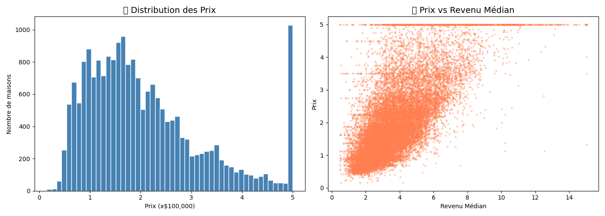
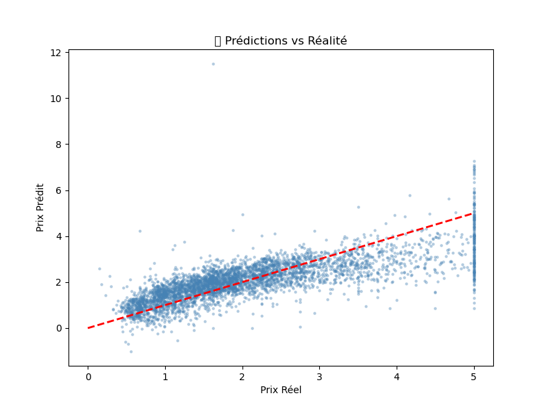

# 🏠 House Price Prediction

Machine Learning model to predict house prices 
using Python & Scikit-learn.

## 📊 Results
- **Dataset**: 20,640 houses (California Housing)
- **Model**: Linear Regression
- **R² Score**: 57.6% accuracy
- **Predicted price example**: $340,150

## 🛠️ Technologies
- Python | Pandas | NumPy
- Matplotlib | Seaborn
- Scikit-learn

## 📈 Visualizations

## 👩‍💻 Author
**Camelea Ariri** — Mathematics & Data Science Student  
FSTM Mohammedia | IBM AI Engineering (In Progress)
